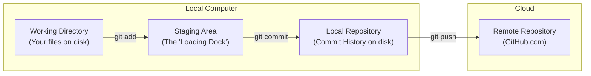

# 🚀 Complete Git & GitHub Learning Guide

This guide walks you through the step-by-step process of initializing a local Git repository, organizing your Coursera courses, and pushing your work to GitHub manually.

---

## 💡 Recommended GitHub Repository Names

Since your workspace contains the specialization **AI Engineering Masterclass From Zero to AI Hero**, here are three recommended names for your GitHub repository:

1. **`ai-engineering-masterclass`** (Professional, simple, and clean)
2. **`zero-to-ai-hero-specialization`** (Specific to the course subtitle)
3. **`coursera-ai-engineering`** (Direct and easy to remember)

---

## 🧠 Core Git Concepts to Learn

Before running any commands, let's understand how Git stores and tracks your files. Git uses **four areas** of storage:



1. **Working Directory (Workspace)**: Your actual folder (`d:\Coursera`) containing all your course files.
2. **Staging Area (Index)**: A temporary preparation area (like a "loading dock"). When you change files, you select which changes are ready to be saved by staging them.
3. **Local Repository (Commit History)**: A hidden directory (`.git`) where Git saves "snapshots" of your project called **commits**. Each commit is a safe restore point.
4. **Remote Repository (GitHub)**: The hosting service in the cloud (GitHub) where your local commits are uploaded so you can share, backup, or access them from other computers.

---

## 🛠️ Step-by-Step Instructions: Initializing and Pushing

Open your terminal or PowerShell in your `d:\Coursera` directory and run these commands manually to see how they work.

### Step 1: Initialize Git
This command tells Git to start tracking changes in this directory. It creates a hidden `.git` folder.
```bash
git init
```
*💡 **What you learned:** You've just turned your normal folder into a local Git repository!*

---

### Step 2: Check the Status
Run this to see what Git sees in your directory:
```bash
git status
```
*💡 **What you learned:** You will see a list of **Untracked files** in red (like `README.md`, `create_day.py`, and `AI Engineering Masterclass From Zero to AI Hero`). Untracked means these files exist on your disk, but Git has not been told to watch them yet.*

---

### Step 3: Add Files to the Staging Area
Now, prepare the files you want to include in your first snapshot (commit).
To add **everything** (except the files listed in `.gitignore`):
```bash
git add .
```
*💡 **What you learned:** You've moved your files to the **Staging Area**. If you run `git status` again, the files will be listed in green under "Changes to be committed". Notice that temporary or junk files aren't shown, because the `.gitignore` file we created is silently filtering them out!*

---

### Step 4: Create Your First Commit
This command takes a permanent snapshot of the staged files and records it in your local commit history.
```bash
git commit -m "Initial commit: Add course structure, README, and organizers"
```
*💡 **What you learned:** The `-m` flag stands for **message**. Every commit requires a short, descriptive message explaining what changed in this version. This makes your project history easy to read.*

---

### Step 5: Rename the Default Branch
By default, Git may name your primary branch `master`. GitHub uses `main` as the standard default branch name. Rename it to match GitHub:
```bash
git branch -M main
```

---

### Step 6: Create the Repository on GitHub.com
1. Open your web browser and go to [github.com](https://github.com).
2. Sign in and click the green **New** button (or **Create repository**).
3. Name your repository (e.g., `ai-engineering-masterclass`).
4. **⚠️ IMPORTANT:** Do **NOT** check any boxes for:
   * *Add a README file*
   * *Add .gitignore*
   * *Choose a license*
   * *(Since we have already created these locally, checking these boxes will cause conflict issues on your first push!)*
5. Click **Create repository**.

---

### Step 7: Connect Local Repo to GitHub
Once created, GitHub will show you a page with setup instructions. Copy the URL of your new repository (it looks like `https://github.com/your-username/ai-engineering-masterclass.git`).
Link your local repository to GitHub by running:
```bash
git remote add origin <YOUR_GITHUB_REPO_URL>
```
*(Replace `<YOUR_GITHUB_REPO_URL>` with your actual copied URL).*

*💡 **What you learned:** `origin` is a shorthand nickname Git uses for the remote server URL on GitHub. You are telling Git: "origin points to this GitHub address".*

---

### Step 8: Push Your Commits to GitHub
Now, upload your commits to GitHub:
```bash
git push -u origin main
```
*💡 **What you learned:** The `-u` flag stands for **upstream**. It tells Git to link your local `main` branch to the `main` branch on `origin`. In the future, you only need to type `git push` instead of the full command!*

---

## 📈 workflow for Future Days (How to update GitHub)

As you complete new weeks and days, you will want to update your GitHub repository. Here is the daily workflow you will use:

### 1. Create a New Day
Run the helper script we created:
```bash
python create_day.py
```
*(Enter the course, week, and day numbers when prompted. It will generate the folder and a `main.py` template file for you).*

### 2. Work on your Exercises
Write your python code in `main.py` and drop any Word docs (`.docx`) with notes into the same day folder.

### 3. Stage, Commit, and Push
When you finish a day or session, run these three commands in your terminal:
```bash
# 1. Stage the new folders and files
git add .

# 2. Save a local snapshot with a progress message
git commit -m "Complete Course 1, Week 1, Day 1 exercises and notes"

# 3. Upload to GitHub
git push
```

---
*Happy learning! You are now on your way to becoming an AI Hero!* 🚀
